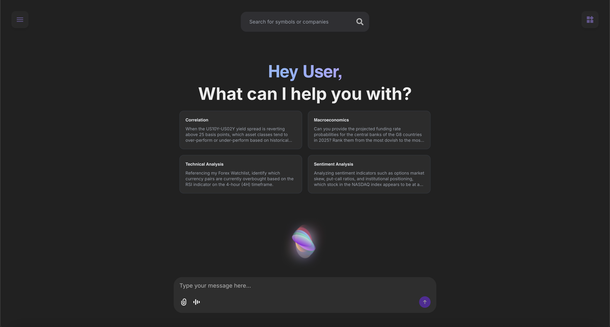

Soteria is BIASafes newest AI engine, designed to revolutionize institutional portfolio management by serving as an assistant through the investment process.
Leveraging advanced machine learning and natural language processing to analyze financial data through its Quant Engine, which has been created with advanced mathematical and statistical functions.

---

## **What It Includes**

- **Portfolio Management System**: A graphical and statistical view on all your investments, making it easier to understand how your money is working for you.
- **API integrations**: With Soteria, you are able to import your finances from worldwide financial institutes such as WealthSimple, Binance, and Bybit using our API integration feature.
- **Live MarketWatch**: Elegant sidebar that displays the latest market news, updates, and stocks right on the Soteria platform.

Soteria includes everything what an investor is looking for, with easy access to your money, simple buy sell process, and a Marketwatch to keep you updated, making it a must have for any institute or retail investor.

## **API Integration**

Soteria allows user to integrate their portfolios using our API integration for popular world wide services.

| Sources          | What they offer                                          |
| ---------------- | -------------------------------------------------------- |
| **Binance**      | Cryptocurrency trading, staking, and market data         |
| **Bybit**        | Advanced scenario generation and derivatives trading     |
| **WealthSimple** | Automated investing, financial planning, and tax tools   |
| **Hyperliquid**  | High-speed trading platform optimized for crypto markets |
