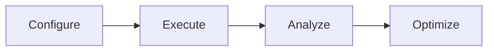

# Advanced Market Simulation Platform

## Powerful Market Simulation & Strategy Testing 🚀

BIASafe AI's Simulation Engine provides institutional-grade market simulation capabilities for comprehensive strategy testing and validation. Our engine recreates real market conditions with high fidelity, enabling thorough strategy evaluation before live deployment.

---

## Why Advanced Simulation Matters 🎯

Traditional backtesting often fails to capture real-world complexity and market dynamics. Our Simulation Engine creates a controlled environment that closely mirrors actual market conditions, helping identify potential risks and opportunities before real capital is deployed.

### Key Benefits ⭐

| Benefit               | Description                                                |
| --------------------- | ---------------------------------------------------------- |
| **Risk-Free Testing** | Validate strategies in a zero-risk environment             |
| **Market Realism**    | Simulate authentic market conditions and edge cases        |
| **Deep Analysis**     | Uncover strategy weaknesses and optimization opportunities |

## Core Features 💫

### Advanced Market Recreation 🎯

```json
{
  "capabilities": [
    "Multiple asset class simulation",
    "Real-world market friction modeling",
    "Dynamic liquidity conditions"
  ]
}
```

### Multi-Scenario Testing 🔄

```json
{
  "features": [
    "Stress testing under various market conditions",
    "Historical event recreation",
    "Custom scenario building"
  ]
}
```

### Comprehensive Analytics 📊

- **Performance Metrics** - Detailed analysis and reporting
- **Risk Analysis** - In-depth risk factor examination
- **Cost Modeling** - Accurate transaction cost simulation

### High-Performance Computing ⚡

> - Parallel simulation processing
> - Cloud-based computation
> - Real-time results analysis

### AI-Enhanced Scenarios 🤖

1. Machine learning-powered market scenarios
2. Behavioral bias simulation
3. Adaptive market conditions

### Market Impact Modeling 📈

- Price impact simulation
- Liquidity analysis
- Slippage estimation

---

## Simulation Process



## Integration Features 🔌

- `Direct connection to Strategy Builder`
- `Real-time data incorporation`
- `Custom API endpoints`
- `Historical data replay`
- `Multi-asset class support`

## Key Technologies 🛠️

| Technology               | Purpose                           |
| ------------------------ | --------------------------------- |
| **Cloud Infrastructure** | Scalable computing resources      |
| **Machine Learning**     | Advanced scenario generation      |
| **Real-time Processing** | Immediate feedback and analysis   |
| **Historical Data**      | Extensive market history database |

---

## Getting Started 🎮

> Ready to test your strategies in our advanced simulation environment?
>
> [Contact our team](/contact) | [View pricing](/pricing)
