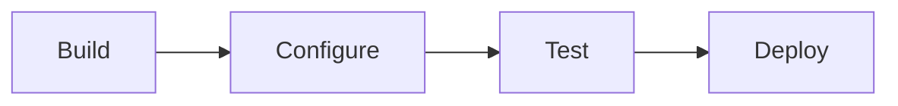

# Strategy Builder Platform 🛠️

## Build Strategies, Test Ideas, and Analyze Data 🚀

BIASafe AI's No-Code R&D platform empowers professionals and teams to perform advanced quantitative research and strategy development without writing a single line of code. From backtesting to live optimization, our platform makes it easy, fast, and reliable.

---

## Why No-Code Matters in Quantitative Finance 💡

Traditional quantitative research requires specialized coding expertise, creating barriers for many professionals. Our No-Code R&D eliminates those barriers, providing a robust environment where anyone can design, test, and implement strategies using intuitive tools.

### Key Benefits ⭐

| Benefit                    | Description                                                                     |
| -------------------------- | ------------------------------------------------------------------------------- |
| **Break Down Barriers**    | Empower non-technical professionals to engage in quantitative workflows         |
| **Accelerate Innovation**  | Shift focus from coding to creative problem-solving and strategy design         |
| **Seamless Collaboration** | Create a unified platform for teams of portfolio managers, analysts, and quants |

## Core Features 💫

### Drag-and-Drop Strategy Builder 🔄

```json
{
  "capabilities": [
    "Design custom strategies using pre-built components",
    "Link modules intuitively to create workflows",
    "Visualize logic step-by-step"
  ]
}
```

### Seamless Data Integration 📊

> - Access real-time and historical data
> - Integrate market data, macroeconomic indicators & alternative datasets
> - Automated data cleaning and normalization

### Workflow Automation ⚡

- Schedule routine backtests and reporting
- Automate data feed integration
- Eliminate repetitive tasks

### Pre-Built Templates 📑

1. Start with ready-to-use templates
2. Popular strategies including:
   - Momentum trading
   - Statistical arbitrage
   - Sector rotation
3. Fully customizable frameworks

### AI-Assisted Optimization 🤖

```json
{
  "features": [
    "Built-in machine learning capabilities",
    "Automated parameter tuning",
    "Dynamic market condition adaptation"
  ]
}
```

### Lightning-Fast Backtesting 🚀

- Test across decades of high-fidelity data
- Run multiple scenarios simultaneously
- Get results in minutes, not hours

---

## Strategy Development Process



## Token Integration 💎

| Feature            | Benefit                                        |
| ------------------ | ---------------------------------------------- |
| **NFT Minting**    | Strategies are minted after successful vetting |
| **BiasCoin Usage** | Platform transactions and rewards              |
| **Governance**     | Participate in strategy upgrades               |
| **Value Growth**   | Token reflects platform success                |

## Getting Started 🎮

> Ready to build your first strategy?
>
> [Contact our team](/contact) | [View pricing](/pricing)

---

<small>© 2024 BIASafe AI - Transforming Quantitative Investment</small>
