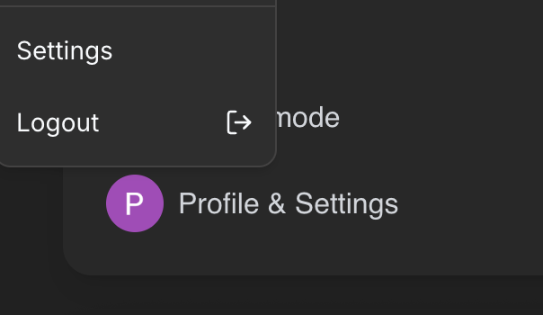
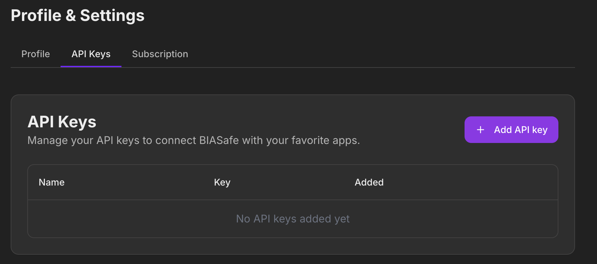

## With Soteria, you are able to import your portfolios on different services!

Using our API feature, you are able to import your Binance, Wealthsimple, and Bybit portfolios onto Soteria
which allows you to manage and view your portfolio on our portfolio section.

---

## Adding APIs

To add an API, follow these simple steps

1. Click your icon at the bottom left and go to "Settings"

## 

2. Go to the API Keys tab and add your desired API Key

## 
