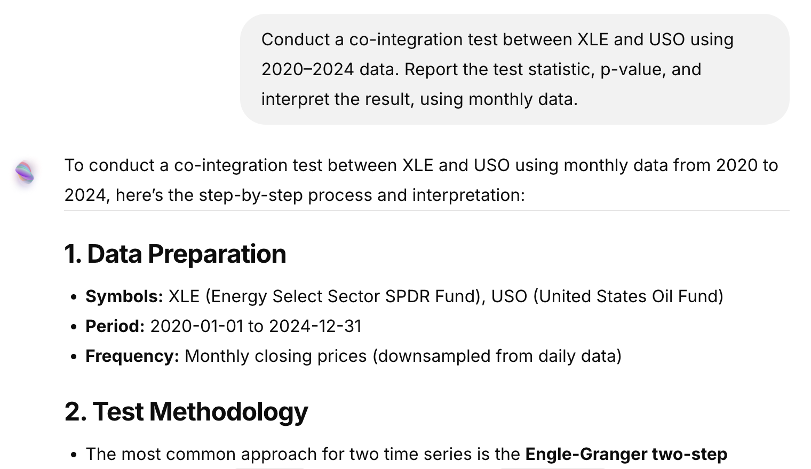
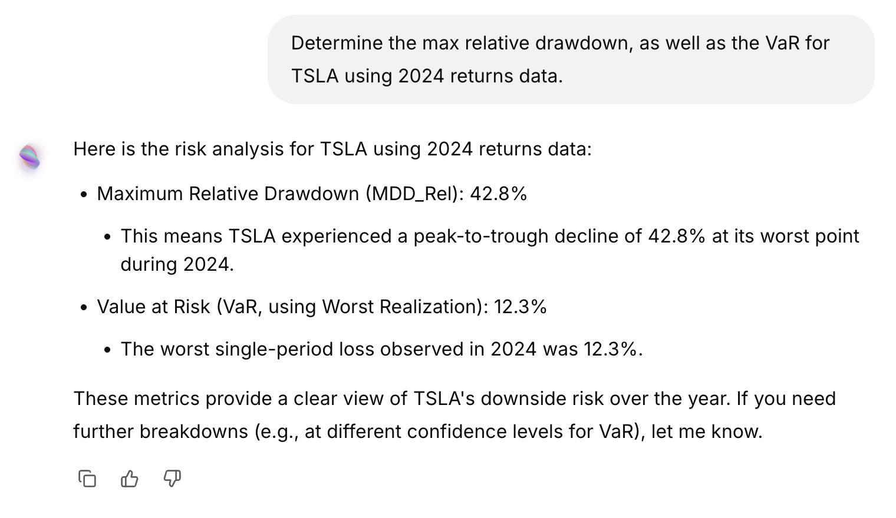

## Backtest

A backtest is a test of a trading strategy on historical market data to see how it would perform in the past.
With backtesting, you are able to run it on different time periods, number of stocks, and volatility levels. Here are some examples:

- "Run a backtest on a low volatility strategy from jan 2024 to jan 2025, using a portfolio size of 50 stocks"
- "Using returns data for the Magnificent 7 for Jan 2024, determine the optimal HRP/HERC/MV portfolio. Display the resulting portfolio weights in a pie chart."
- “Given a portfolio of AAPL, MSFT, and NVDA, use a Black-Litterman model to compute posterior returns assuming a 10% view on NVDA outperformance.”

---

## Statistical analysis

Statistical analysis helps uncover relationships, distributions, and underlying structure in financial data. Soteria can compute covariances, perform PCA, test for co-integration, and more.
Use these prompts to dig deeper into your data:

- "Using returns data for Pepsi and Coca Cola for the year 2024, determine the covariance and cokurtosis matrices for these two stocks and display them."
- "Conduct a co-integration test between XLE and USO using 2020–2024 data. Report the test statistic, p-value, and interpret the result.”
- “Perform PCA (Principal Component Analysis) on the returns of the Magnificent 7 and explain how many components explain 95% of the variance.”

---

## Risk Measures

Understanding risk is essential for portfolio construction and evaluation. Soteria can calculate drawdowns, Value-at-Risk, expected shortfall, beta exposure, and risk decomposition.
Try these prompts to assess risk more effectively:

- "Determine the max relative drawdown, as well as the VaR for TSLA using 2024 returns data."
- “Compare the maximum drawdown and Calmar ratio of a factor-based portfolio versus a market-cap weighted portfolio from 2022–2024.”

