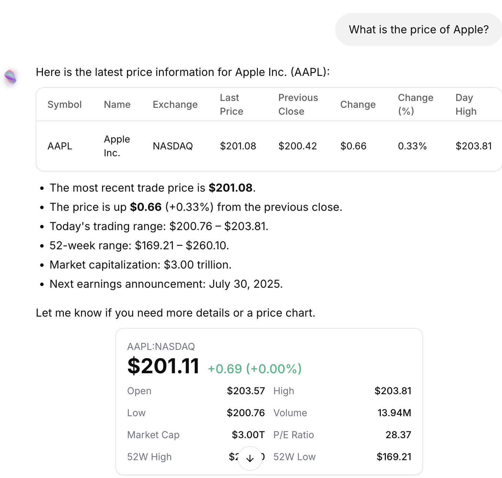
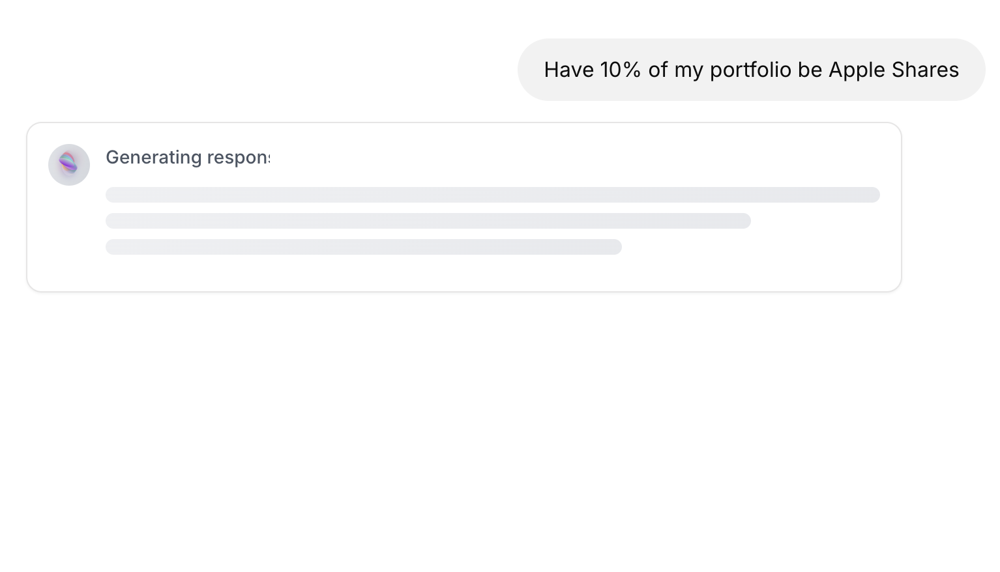
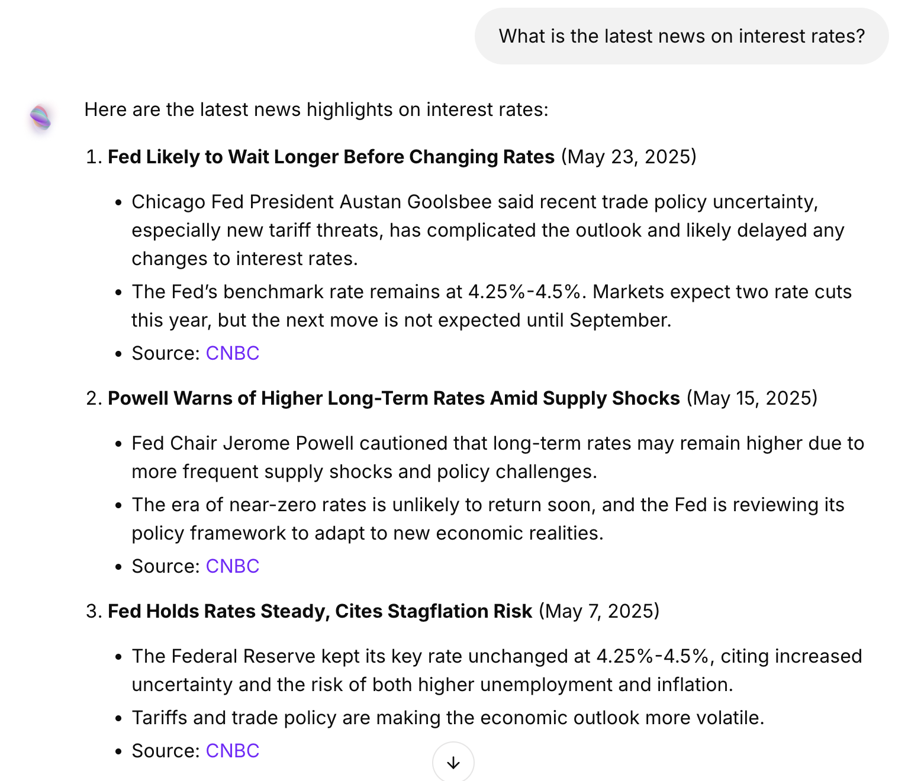
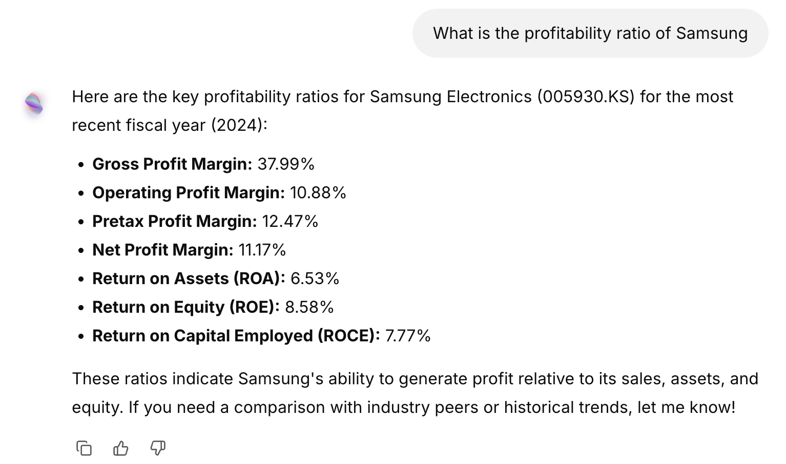

Soteria provides a lot of options and tools that can help you succeed in the markets. Lets go over some easy prompts.

## Prices and Changes

Soteria can easily provide you with up-to-date pricing information with some simple prompts such as:

- "What is the price of Apple?"
- "What is the price change in Apple over the past 30 days"
- "How is ETH doing todays?

## 

---

## Plotting

Soteria can also visualize the data for you with different types of graphs.

- "Plot Teslas stock over the last year"
- "Plot Teslas stock and Apples stock side by side in a line graph"
- "Use Candlesticks to plot Bitcoin"

## 

---

## Purchase and Selling

Soteria can also automate your transaction, allow you to have a centralized source to manage all your transactions,

- "Buy 5 stocks of Apple"
- "Sell my position in Solana"
- "Have 10% of my portfolio be Apple Shares"

## 

---

## Fundamentals and News

Soteria also provides users with the ability to get financial information about companies and be able to analyze it themselves.

- "Get me the latest income statement for Microsoft"
- "provide the most up to date balance sheet for Tesla"
- "Give me the q1 cash flows for Google"
- "What is the latest news on interest rates?"

## 

---

# General Research and Information gathering

You are able to get one of the best analytics on general news about the market, and relevant ratios, values, and factors as well.

- "What is the profitability ratio of Samsung"
- "What is the latest news on Tariffs?
- "What is the PE, Cash, and PB ratio of Snowflake?"

## 

---

**Now that you understand what you can do with Soteria, lets talk about some of the in-depth analytics you can do.**
