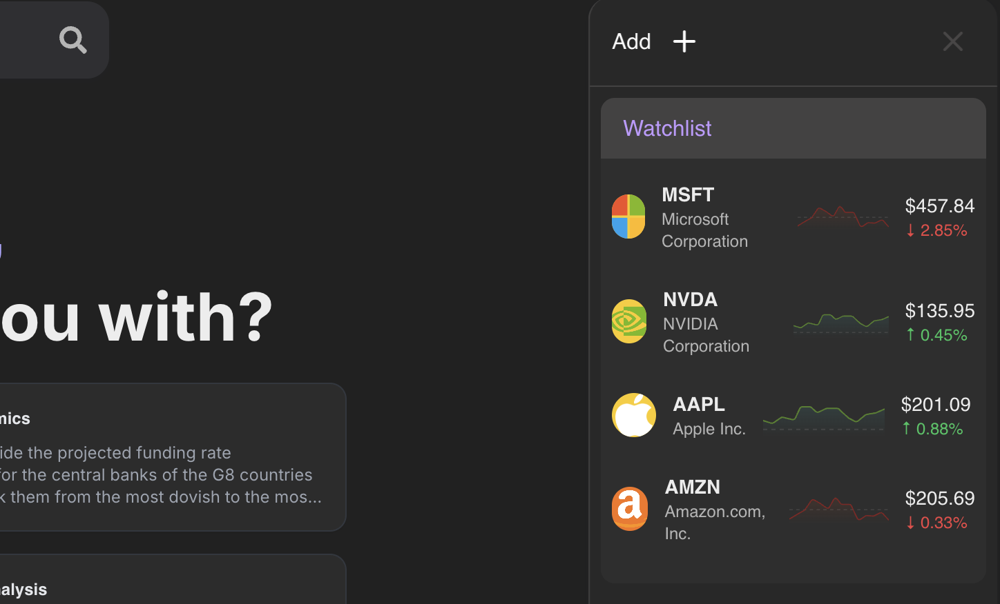
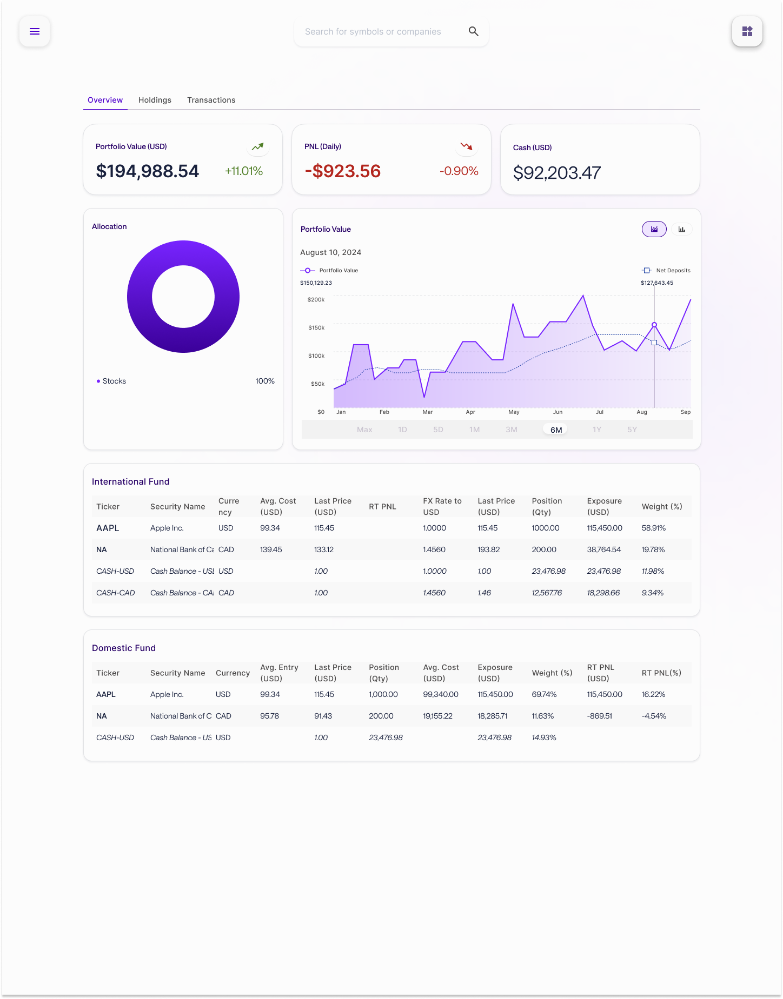
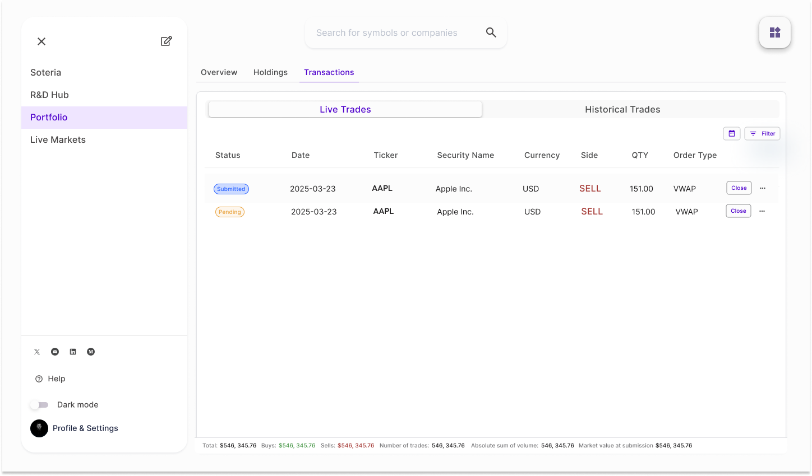
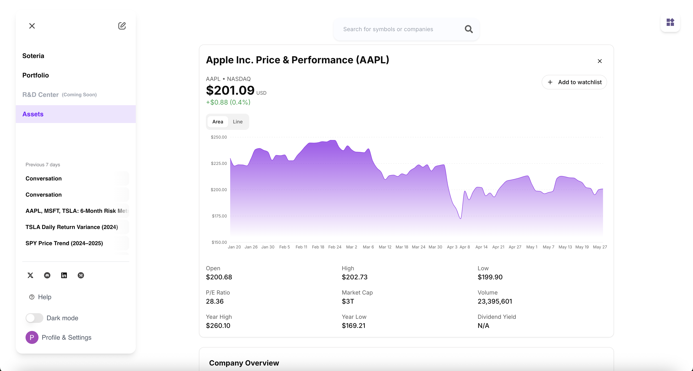

## Lets go over the design on Soteria

1. **Watchlist**

The watchlist can be viewed by clicking the icon at the top right corner. In the watchlist, you are able to view stocks that you have chosen to follow.
You can add stocks to your watchlist by either going to the Assets page and searching the stocks, or by selecting the "Add" button on the watchlist.

## 

---

2. **Portfolio**

You can view your portfolio on the Portfolio page in the left sidebar. Once there on the **Overview** tab,
you are able to view your Portfolio value, daily PNL (Profit-Net-Loss), cash, allocations donut graph, your portfolio value graphed, and a list of your holdings.

## 

On the **Transactions** tab, you are able to view your transactions that are either pending, or have been successfully submitted.

## 

---

3. **Assets**

On the Assets page, you are able to view an in-depth analysis on companies financial metrics. You are also able to add items it your Watchlist, and
virtually see everything you would want to know about a company before investing in them.

## 

---
