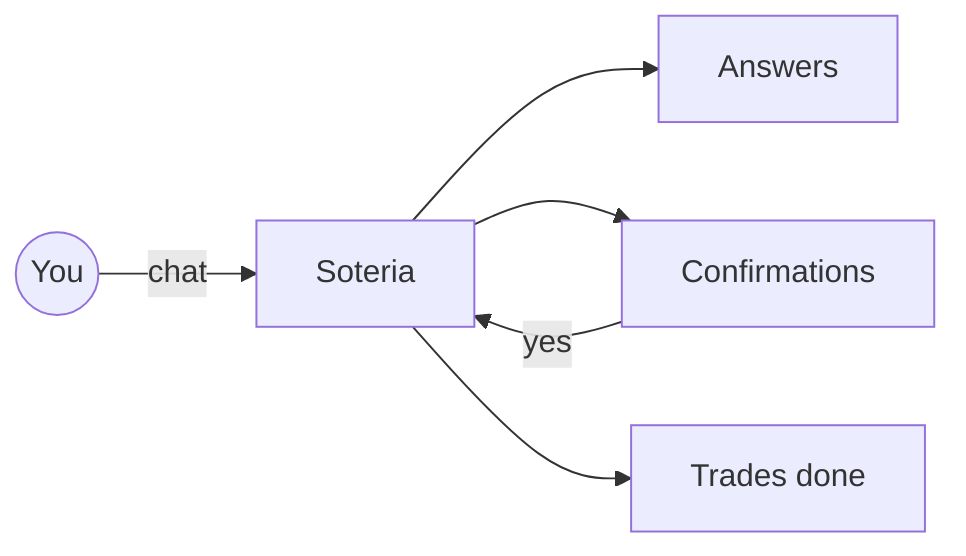

---

title: What can you do?
description: A quick tour of Soteria’s super‑powers—no jargon required.
-----------------------------------------------------------------------

> **info**
> Use this page like a restaurant menu. Pick what you need, copy the sample prompt, and you’re off.

## TL;DR

Soteria is your finance side‑kick. Ask plain‑English questions and it can:

* look up prices, headlines, and company facts,
* show how your portfolio is doing,
* suggest a smarter mix of investments,
* place trades once you give the green light,
* turn rows of numbers into easy‑to‑read charts and tables.



---

## What Soteria can help you with

### 1 · Look up market info

* Get today’s share price or a ten‑year chart.
* Pull key numbers from a company’s financial reports.
* Read the latest news and earnings call quotes.

*Example prompt*

```text
Show me Nvidia’s gross‑margin trend and latest AI‑chip headlines.
```

---

### 2 · Check your portfolio

* See every holding, its value, and your cash balance.
* Run a “what‑if” back‑test to see how the mix would have worked in the past.
* Spot the riskiest positions at a glance.

*Example prompt*

```text
Back‑test my portfolio over the last 3 years and highlight the biggest drawdown.
```

---

### 3 · Get smarter allocations

* Ask for new weights based on the Black‑Litterman method (fancy talk for balancing your own views with market data).
* Preview the exact buys and sells needed to reach those weights.
* Decide if you want to go ahead.

*Example prompt*

```text
Use Black‑Litterman with bullish views on MSFT & NVDA to propose new weights.
```

---

### 4 · Place or cancel trades

* Draft a trade ticket for stocks, ETFs, or crypto.
* Wait for your **explicit** “Yes, execute” before sending anything to the market.
* Check the exchange response and log every order for your records.

*Example prompt*

```text
Buy 100 AAPL @ market, then show me the reconciliation log.
```

---

### 5 · Turn data into visuals

* Any time‑series data can become an interactive chart.
* Tables are auto‑formatted so you can copy them into Excel or Sheets.

*Example prompt*

```text
Plot the 30‑day rolling volatility of BTC vs ETH since 2022‑01‑01.
```

---

## Handy verbs to try

| Verb                   | Ask this                            | Soteria will…                          |
| ---------------------- | ----------------------------------- | -------------------------------------- |
| *"fetch price"*        | “Fetch the live price of TSLA.”     | Show today’s quote.                    |
| *"analyse earnings"*   | “Analyse Apple’s latest earnings.”  | Summarise growth, margins, and trends. |
| *"optimise portfolio"* | “Optimise my portfolio.”            | Suggest new weights & trades.          |
| *"place order"*        | “Place a market order for 50 MSFT.” | Draft → ask → execute if approved.     |

> **next‑step** · See the [Portfolio Back‑test](./portfolio-backtest) page for a full walk‑through.
